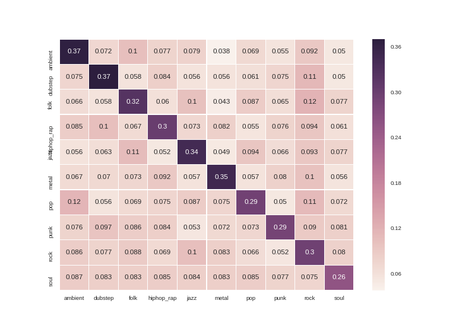

# Album Art

Determining an album's genre based on its cover art. I downloaded 10,000 album covers across 10 genres, and split them 70/30 train/test.

I've built two models:

* a simple model which computes the colour histogram for each image, and uses Annoy to get a given test image's nearest neighbours in 512-d space.

* a CNN, using the VGG16 net's weights with the top 4 dense layers re-trained.

 
 
